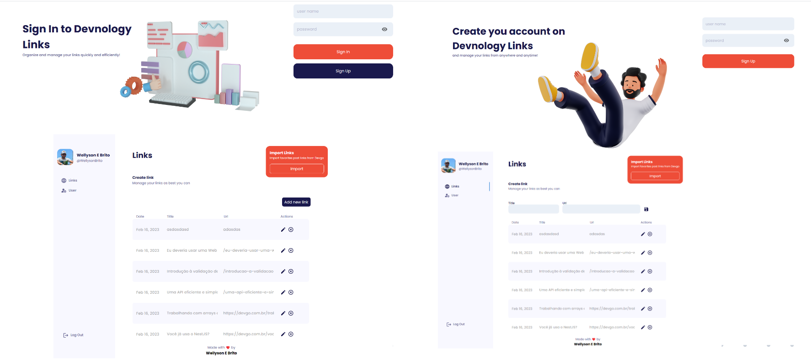

<table align="center">
 
 <tr>
  
  <td align="center" width="9999">
   


<br>

# Devnology Links

Um web app de gerenciamento de links de artigos de tecnologia, feito com NodeJs e ReactJS 
   
   <br>
   
   Link da aplicação online: <a href="https://devnology-challenge-front-end.vercel.app/">https://devnology-challenge-front-end.vercel.app/</a> 
   
</td>
 
 </tr>
 
</table>

<br>

# 🎨 Telas



<br>


# 📃 Sobre o projeto
Um web app  que permite salvar e gerenciar links favoritos da web em um repositório central e nunca mais perder um link importante novamente. Podendo ser acessado por diversos dispositivos como smartphones, tablets e computadores.

O aplicativo também conta com função de sincronizar os links dos principais artigos do blog [devGo](https://devgo.com.br/)

Desenvolvido para o desafio da Devnology
<br>
<br>

# Funcionalidades
-   Criar conta
- Logar na conta

-   Criar um link com titulo e url
-  Atualizar um link
- Deletar um link 
- Importar links do blog [devGo](https://devgo.com.br/)


<br><br>

# 🛠 Tecnologias utilizadas

## Back-End 

-  🟢 NodeJS
-  🔵 TypeScript
-   🟦Express - Criar o Servidor
-   🧩 Prisma ORM - Gerenciar o Banco de Dados
-  📅 PostrgressSQL (Banco de Dados)
-   📡Axios - Comunicação com site da [devGo](https://devgo.com.br/)
-   🤖 Cheerio - (Web Crawler)

<br>

## Frot-End
-   ⚛ ReactJs (Vite)
-   ⚛ React Router Dom - Controle de Rotas
-   🫧Materil UI - Para a estilização dos componentes
-   📡Axios - Comunicação com a API Back-End

<br>

# 🚀 Rodando o projeto

A aplicação é dividida em duas partes, <b>back-end</b> que é a api responsável por gerenciar os link e retorna os dados, e <b>front-end</b> que é o front-end

## Pré-requisitos
-   Git
-   NodeJS
-   Yarn ou Npm
    <br>

## 💻 Rodando o Back-End

Clone o repositório

```bash
# Clone o repositório
git clone https://github.com/WBGreenArrow/devnology-challenge.git
```
Navegue até a pasta do projeto clonado e execute os comandos abaixo

```bash
# Entra na pasta do projeto 
cd devnology-challenge

# Entra na pasta back-end 
cd back-end

# Instala as dependências
yarn install
```

Após concluir a instalação das dependências, configure as variáveis de ambiente. Na raiz do projeto crie um arquivo chamado `.env` e coloque as seguinte variáveis com suas informções.

```shell
DATABASE_URL= url de configuração do banco de dados postgress
JWT_SECRET= chave para criar os tokens de autenticação
```
Com as variáveis de ambiente configuradas, é hora de configurar o banco de dados e gerar as tabelas.

Se o Banco de Dados estive local. No diretório raiz do projeto execute o seguinte comando no terminal.
```bash
# Configurar as tabelas no banco de dados local
npx prisma migrate dev
```
Caso o banco esteja remoto. No diretório raiz do projeto execute comando no terminal.
```bash
# Configurar as tabelas no banco de dados remoto
npx prisma db push
```
Após configurar o banco de dados podemos executar a aplicação.😁
```bash
# Executar aplicação
yarn run dev

# Após isso a aplicação pode ser utilizada acessando o endereço http://localhost:3000/
```
<br>

## 🖥 Rodando o Front-End 

Caso já tenha clonado o repositório basta pular a primeira etapa

```bash
# Clone o repositório
git clone https://github.com/WBGreenArrow/devnology-challenge.git
```
Navegue até a pasta do projeto clonado e execute os comandos abaixo


```bash
# Entra na pasta do front-end
cd front-end

# Instala as dependências
yarn install

```
Após concluir a instalação das dependências, ainda no terminal da pasta do front-end execute o comando abaixo
```bash
# Inicia a aplicação
yarn run dev

# Após isso a aplicação pode ser utilizada acessando o endereço http://localhost:5173/
```
